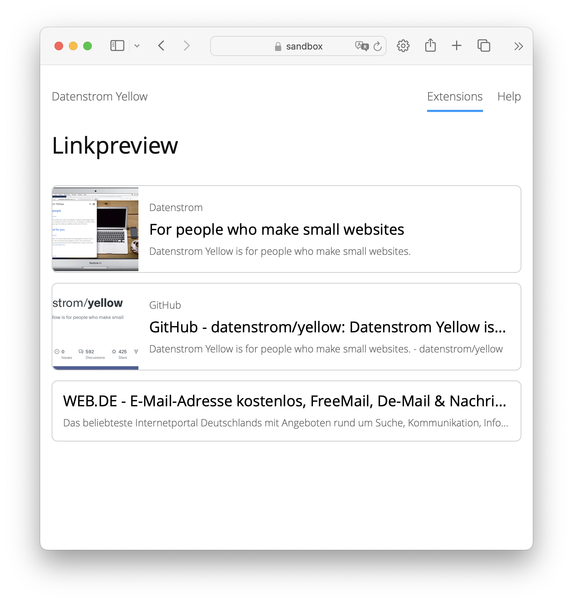

# Linkpreview 0.8.18

Shows a link preview for selected links

<p align="center"></p>

## How to install the extension

[Download ZIP file](https://github.com/pftnhr/yellow-linkpreview/archive/refs/heads/main.zip) and copy it into your `system/extensions` folder. [Learn more about extensions](https://github.com/annaesvensson/yellow-update).

## How to show a link preview.

Create a link card that displays content from the `meta` properties of the linked website. If it has no `meta` properties, at least the `title` is displayed.

The link preview is only generated if it is inserted as a block element. If the shortcode is inadvertently inserted as an inline element, a normal link is generated.

### Appearance

You can influence the appearance of the paragraph by adapting the file `system/extensions/linkpreview.css` to your needs.

## Examples

Put a shortcode per link anywhere in your page

    [linkpreview https://example.com]

## Stylesheets

Since I have removed the stylesheet from the extension so that you can integrate all style specifications in your own stylesheets, I will give you the standard styles here as `CSS` and, if you prefer, as `SASS`.

### CSS

``` css
.linkpreview {
  align-items: center;
  border: 1px solid rgb(207, 213, 226);
  border-radius: 0.25rem;
  color: rgb(77, 83, 94);
  display: flex;
  margin-top: 14px;
  overflow: hidden;
  position: relative;
  text-decoration: none;
}

.linkpreview__content {
  box-sizing: border-box;
  flex: 1 1 auto;
  max-width: 100%;
  overflow: hidden;
  padding-inline: 1rem;
}

.linkpreview__content__title {
  color: rgb(45, 49, 56);
  display: block;
  font-size: 24px;
  font-weight: 500;
  line-height: 24px;
  overflow: hidden;
  text-overflow: ellipsis;
  white-space: nowrap;
  margin-block: 8px;
}

.linkpreview__content__description,
.linkpreview__content__host {
  display: block;
  overflow: hidden;
  font-size: 14px;
  text-overflow: ellipsis;
  white-space: nowrap;
}

.linkpreview__image {
  aspect-ratio: 1;
  flex: 0 0 auto;
  position: relative;
  width: 110px;
}

.linkpreview__image img {
  background-position: 50%;
  background-size: cover;
  display: block;
  height: 100% !important;
  margin: 0;
  -o-object-fit: cover;
  object-fit: cover;
  width: 100%;
}

a.linkpreview {
  cursor: pointer;
}

a.linkpreview:active,
a.linkpreview:focus,
a.linkpreview:hover,
a.linkpreview:active .linkpreview__content__description,
a.linkpreview:active .linkpreview__content__url,
a.linkpreview:active .linkpreview__content__title,
a.linkpreview:focus .linkpreview__content__description,
a.linkpreview:focus .linkpreview__content__url,
a.linkpreview:focus .linkpreview__content__title,
a.linkpreview:hover .linkpreview__content__description,
a.linkpreview:hover .linkpreview__content__url,
a.linkpreview:hover .linkpreview__content__title {
  color: rgb(77, 83, 94);
  text-decoration: none;
}
```

### SASS

```scss
.linkpreview {
    align-items: center;
    border: 1px solid rgb(207, 213, 226);
    border-radius: .25rem;
    color: rgb(77, 83, 94);
    display: flex;
    margin-top: 14px;
    overflow: hidden;
    position: relative;
    text-decoration: none;

    &__content {
        box-sizing: border-box;
        flex: 1 1 auto;
        max-width: 100%;
        overflow: hidden;
        padding-inline: 1rem;

        &__title {
            color: rgb(45, 49, 56);
            display: block;
            font-size: 24px;
            font-weight: 500;
            line-height: 24px;
            overflow: hidden;
            text-overflow: ellipsis;
            white-space: nowrap;
            margin-block: 8px;
        }

        &__description,
        &__host {
            display: block;
            overflow: hidden;
            font-size: 14px;
            text-overflow: ellipsis;
            white-space: nowrap
        }
    }

    &__image {
        aspect-ratio: 1;
        flex: 0 0 auto;
        position: relative;
        width: 110px;

        img {
            background-position: 50%;
            background-size: cover;
            display: block;
            height: 100% !important;
            margin: 0;
            -o-object-fit: cover;
            object-fit: cover;
            width: 100%;
        }
    }
}

a.linkpreview {
    cursor:pointer;
    
    &:active,
    &:focus,
    &:hover,
    &:active .linkpreview__content__description,
    &:active .linkpreview__content__url,
    &:active .linkpreview__content__title,
    &:focus .linkpreview__content__description,
    &:focus .linkpreview__content__url,
    &:focus .linkpreview__content__title,
    &:hover .linkpreview__content__description,
    &:hover .linkpreview__content__url,
    &:hover .linkpreview__content__title {
        color: rgb(77, 83, 94);
        text-decoration: none;
    }
}
```

## Developer

Robert Pfotenhauer. [Get help](https://datenstrom.se/yellow/help/).

